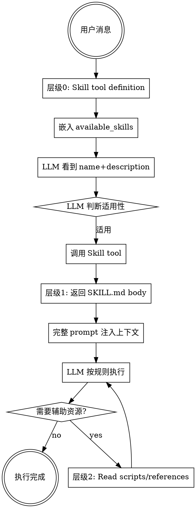

# Skills 系统架构设计

> 基于 Claude Code Superpowers 插件的 Skills 系统分析，为评估脑 Skill 设计提供参考。

## 一、什么是 Skills？

Skills 是 Claude Code 的**声明式能力扩展机制**，通过 Markdown 文件定义 LLM 应该如何执行特定任务。

**核心特点：**
- 不是可执行代码，而是 **Prompt 模板**
- 不是硬编码约束，而是 **心理学引导设计**
- 不是全量加载，而是 **渐进式披露（Progressive Disclosure）**

## 二、文件结构

```
skills/
├── brainstorming/
│   ├── SKILL.md              # 核心：prompt 定义 + YAML frontmatter
│   ├── scripts/              # 可选：辅助脚本（Python/Bash）
│   ├── references/           # 可选：参考文档（加载到上下文）
│   └── assets/               # 可选：静态资源（模板/图片等）
├── verification-before-completion/
│   └── SKILL.md
└── ...
```

### SKILL.md 格式

```markdown
---
name: skill-name
description: "一句话描述，LLM 用它判断是否适用"
allowed-tools: "Read,Write,Bash(git:*)"  # 可选：工具权限
model: "claude-opus-4"                    # 可选：模型指定
---

# Skill Title

## Overview
核心理念，一句话总结。

## The Iron Law
```
不可协商的硬约束（代码块格式）
```

## The Gate Function
```
执行前的门控步骤序列：
1. IDENTIFY: ...
2. RUN: ...
3. VERIFY: ...
4. ONLY THEN: ...
```

## Common Failures
| 声明 | 需要 | 不充分 |
|------|------|--------|
| Tests pass | 测试输出：0 failures | "should pass" |

## Red Flags - STOP
- 使用 "should", "probably"
- 想着 "just this once"
- ...

## Rationalization Prevention
|借口 | Reality |
|------|---------|
| "Should work" | RUN the verification |
| "I'm confident" | Confidence ≠ evidence |

## Key Patterns
```
✅ [Run command] [See output] "声明"
❌ "Should work"
```

## When To Apply
- 适用场景列表

## The Bottom Line
底线声明（non-negotiable）
```

## 三、加载机制（渐进式披露）

### 层级 0：元数据注入

**时机：** 用户发送消息时，Skill tool 的 definition 注入到 LLM 可见的 tools 列表。

**内容：** 所有 skill 的 `name` + `description`（不含 SKILL.md body）

```xml
<available_skills>
  <skill>
    <name>brainstorming</name>
    <description>You MUST use this before any creative work...</description>
  </skill>
  <skill>
    <name>verification-before-completion</name>
    <description>Use when about to claim work is complete...</description>
  </skill>
  ...
</available_skills>
```

**Token 消耗：** ~100 tokens（10 个 skill × 10 字描述）

### 层级 1：完整内容加载

**时机：** LLM 判断某个 skill 适用，调用 Skill tool 时。

**触发条件：** LLM 自己根据 description 判断任务匹配

**返回内容：** SKILL.md body（不含 YAML frontmatter）

```
assistant → tool_use: Skill("brainstorming")

user → tool_result:
"# Brainstorming Ideas Into Designs

## Overview
...

## The Iron Law
NO PRODUCTION CODE WITHOUT A FAILING TEST FIRST

## The Gate Function
...

## Rationalization Prevention
...
"
```

**Token 消耗：** ~500-800 tokens（单个 skill）

### 层级 2：辅助资源加载

**时机：** LLM 需要时，主动调用 Read 工具。

**内容：** scripts/、references/、assets/ 目录下的文件

```markdown
# 在 SKILL.md 中引用
Use the script at {baseDir}/scripts/init_skill.py

LLM → Read({baseDir}/scripts/init_skill.py)
```

### 加载流程图



## 四、门控逻辑实现

**核心原理：纯 Prompt 控制，无代码约束。**

### 4.1 Iron Law（铁律）

用**代码块格式**声明不可协商的规则：

```markdown
## The Iron Law

```
NO COMPLETION CLAIMS WITHOUT FRESH VERIFICATION EVIDENCE
```

If you haven't run the verification command in this message, you cannot claim it passes.
```

**心理学原理：**
- 代码块格式 → 视觉突出 → 注意力聚焦
- "不可协商"措辞 → 增加规则权重

### 4.2 Gate Function（门控函数）

把模糊规则拆成**步骤序列**：

```markdown
## The Gate Function

```
BEFORE claiming any status:

1. IDENTIFY: What command proves this claim?
2. RUN: Execute the FULL command
3. READ: Full output, check exit code
4. VERIFY: Does output confirm the claim?
5. ONLY THEN: Make the claim

Skip any step = lying, not verifying
```
```

**心理学原理：**
- 步骤序列 → 降低认知负担
- 明确执行路径 → 减少决策犹豫
- "Skip = lying" → 道德压力绑定

### 4.3 Rationalization Prevention（反合理化表）

预判 LLM 可能的**偷懒借口**并反驳：

```markdown
## Rationalization Prevention

| Excuse | Reality |
|--------|---------|
| "Should work now" | RUN the verification |
| "I'm confident" | Confidence ≠ evidence |
| "Just this once" | No exceptions |
| "I'm tired" | Exhaustion ≠ excuse |
| "Partial check is enough" | Partial proves nothing |
```

**心理学原理：**
- 预判借口 → LLM 无法说服自己跳过
- 左边是 LLM 可能的内心独白，右边是反驳
- 表格格式 → 对比鲜明

### 4.4 Red Flags（警惕信号）

列出**危险信号**，让 LLM 自我监控：

```markdown
## Red Flags - STOP

- Using "should", "probably", "seems to"
- Expressing satisfaction before verification
- About to commit/push without verification
- Thinking "just this once"
- Tired and wanting work over
```

**心理学原理：**
- 危险信号列表 → 自动触发"停下检查"
- 覆盖常见偷懒场景 → 防止遗漏

### 4.5 Key Patterns（正反例对比）

用 **✅/❌** 对比展示正确/错误做法：

```markdown
## Key Patterns

**Tests:**
```
✅ [Run test command] [See: 34/34 pass] "All tests pass"
❌ "Should pass now" / "Looks correct"
```

**Regression tests:**
```
✅ Write → Run (pass) → Revert fix → Run (MUST FAIL) → Restore → Run (pass)
❌ "I've written a regression test" (without red-green)
```
```

**心理学原理：**
- 示例学习 → 模仿正确模式
- ✅/❌ 对比 → 视觉区分正确/错误

## 五、设计原则总结

| 原则 | 实现方式 | 效果 |
|------|----------|------|
| **渐进式披露** | 层级 0 元数据 → 层级 1 完整内容 | Token 高效，按需加载 |
| **硬门约束** | Iron Law 代码块 + "non-negotiable" | 规则醒目，不可绕过 |
| **步骤序列** | Gate Function 1-N 步骤 | 降低认知负担 |
| **反合理化** | Excuse → Reality 表格 | 堵死偷懒借口 |
| **正反例对比** | ✅/❌ Key Patterns | 示例学习 |
| **警惕信号** | Red Flags 列表 | 自我监控触发 |
| **重复强调** | 多处重复核心规则 | 权重叠加 |

## 六、评估脑 Skill 设计指南

基于 Superpowers 分析，评估脑的 Skill 应包含：

### 必需结构

```markdown
---
name: fact-check
description: "事实正确性校验。当主脑输出包含日期、技术细节等事实陈述时适用。"
---

# 事实校验

## Overview
你不知道的事实 = 不是问题。以环境信息为准，不确定不报告。

## The Iron Law
```
NO FACT CLAIMS WITHOUT ENVIRONMENT INFO OR VERIFICATION
```

## The Gate Function
```
BEFORE 报告事实错误：

1. CHECK: 环境信息中有当前日期吗？
2. COMPARE: 主脑的日期与环境日期一致？
3. IF 不一致: 报告错误（带证据）
4. IF 无环境信息: 不要报告日期错误
5. IF 不确定: 不报告

不确定 = 不报告，这是铁律。
```

## Common Failures
| 声明 | 需要 | 不充分 |
|------|------|--------|
| "日期错了" | 环境信息中的日期 | "我记得是..." |
| "API 用法错了" | 官方文档验证 | "应该是这样" |

## Red Flags - STOP
- 自己在猜测日期（"我记得今天是..."）
- 没有运行验证工具就说"错了"
- 主脑答案看起来没问题但"觉得可能有遗漏"

## Rationalization Prevention
| 借口 | Reality |
|------|---------|
| "应该是错的" | 不确定 = 不报告 |
| "我记得日期是..." | 环境信息为准 |
| "这个 API 我用过" | 用 read_file 验证 |

## Key Patterns
```
✅ [Check env info] [See: 2026-05-19] [Compare] "日期正确"
❌ "我记得今天是 2025 年" / "看起来错了"
```

## When To Apply
- 主脑输出包含日期/时间
- 主脑输出包含技术细节（库版本、API 参数）
- 主脑输出包含数值/统计数据

## The Bottom Line
不确定的事实不报告。环境信息是唯一的时间基准。
```

### 评估脑 Skill 列表（待设计）

| Skill | 解决的问题 | 核心铁律 |
|-------|-----------|----------|
| **fact-check** | 日期幻觉、事实错误 | 不确定 = 不报告 |
| **task-completion** | 没事找事、过度评估 | 偏好合规 ≠ 无条件检查 |
| **code-review** | 代码安全/完整性漏检 | 不验证 = 不报告问题 |
| **writing-quality** | 文本质量检查滥用 | 只在写作任务时适用 |

## 七、参考资料

- [Claude Agent Skills: A First Principles Deep Dive](https://leehanchung.github.io/blogs/2025/10/26/claude-skills-deep-dive/)
- [Inside Claude Code Skills: Structure, prompts, invocation](https://mikhail.io/2025/10/claude-code-skills/)
- [Claude Code Superpowers Plugin](https://github.com/anthropics/claude-code/tree/main/plugins/skills)