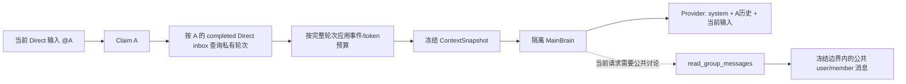

# Web 房间成员私有连续上下文设计

**日期**: 2026-08-19
**状态**: 已实现并验证
**模块**: `ai-brain-cli/web`、`brain-main`、`knowledge-core`

---

## 1. 结论

方案可行，现有数据模型已经能区分：

- 用户消息明确发给了哪些实例；
- 某个实例针对哪条来源消息执行；
- 该次 Direct 执行最终生成了哪条回复；
- 某条回复属于 Direct 处理还是 Participation 公共参与；
- 当前任务允许看到的房间事件截止序号。

首版不需要新增表或升级协作数据库版本。核心调整是把 Direct 成员运行的自动上下文从
“群房间最近三条用户消息窗口”改为“该成员已完成的 Direct 私有轮次”，同时保留并加强
现有 `read_group_messages` 工具，让实例只在当前请求确实依赖公共讨论时主动读取房间消息。

目标 Provider 消息序列为：

```text
system(
  全局规则
  + 运行环境
  + 技能
  + 当前成员策略/引用/交接/召回上下文
)
user      发给 A 的历史输入 1
assistant A 的历史回复 1
user      发给 A 的历史输入 2
assistant A 的历史回复 2
...
user      当前发给 A 的输入
```

其他实例的普通房间回复、只发给其他实例的用户消息，不自动进入 A 的消息序列。

---

## 2. 当前问题

当前 `member_history` 在 `claim.group_enabled` 时使用房间级窗口：

1. 找到包含当前输入在内的最近三条用户消息；
2. 排除当前输入；
3. 自动加入剩余用户消息和当前实例在窗口中的回复；
4. 排除其他实例的回复。

这会同时产生两个错误结果：

- A 之前自己的连续对话被较新的 B 对话挤出；
- 只发给 B 的用户消息会进入 A 的自动上下文。

另外，当前非群分支虽然接近成员私有历史，但仍不能原样复用：

- 它选择 A 在房间内发送的全部 `member_message`，包括 Participation 发言；
- 它不包含明确发给 A 的历史成员交接输入；
- 历史按单事件裁剪，token 边界可能只留下 assistant 而丢掉对应 user；
- 成员策略上下文内部标为 system，但发送 Provider 时被历史转换层映射为 user。

因此本次修改必须以 Direct inbox 轮次为边界，而不是只替换一段 sender SQL。

---

## 3. 目标

### 3.1 功能目标

1. Direct `@A` 自动恢复 A 在当前房间内的连续私有轮次。
2. 私有轮次只来自明确投递给 A 的 Direct inbox。
3. 用户只发给 B 的消息和 B 的普通回复不进入 A 的自动上下文。
4. 用户同时 `@A @B` 时，同一用户输入分别进入 A、B 的私有历史，各自只配自己的回复。
5. 明确的 B -> A 成员交接属于 A 的 Direct 输入，以带发送者标签的 user 角色恢复。
6. Participation 公共参与记录继续使用现有话题局部上下文，不进入 Direct 私有历史。
7. 公共房间消息通过 `read_group_messages` 按需读取，不再自动注入最近三条。
8. 同一持久任务的重试/恢复继续复用冻结的 `ContextSnapshot`。
9. 超长历史按完整 Direct 轮次裁剪，不产生孤立 assistant。

### 3.2 工程目标

1. 不增加协作数据库表或强制 schema migration。
2. 不改变现有任务快照 JSON 结构和 `collaboration-task-v6` 恢复能力。
3. 保留当前输入、回复引用、成员交接文件路径的去重和完整性校验。
4. 房间工具仍受 room scope、capability 和冻结序号边界约束。
5. 行为可通过仓储单测、上下文单测和捕获 Provider 请求的集成测试验证。

### 3.3 非目标

- 不创建 Provider 侧持久会话；每次运行仍从冻结快照重建隔离 `MainBrain`。
- 不把文件内容自动塞入后续上下文；文件内容仍通过文件工具读取。
- 首版不实现 LLM 驱动的成员私有历史摘要。
- 不改变 Participation 的自动发言判断、辩论深度和无工具策略。
- 不修改 Web 消息展示、分页或滚动行为。
- 不把非群模式的私有消息暴露给房间工具；工具仍只在 `group_enabled` Direct 运行中提供。

---

## 4. 术语和不变量

### 4.1 Direct 来源

`member_inbox_items.purpose = 'direct'` 的 `source_event_id`：

- 用户事件：用户明确把消息发给该 member；
- 成员事件：另一个实例明确 `@` 该 member 形成的成员交接。

`room_event_recipients` 和 inbox 的唯一约束保证同一来源不会重复投递给同一成员。

### 4.2 私有轮次

一个已完成 Direct inbox 对应一个私有轮次：

```text
source_event -> reply_event
```

来源映射为 Provider user，reply 映射为 Provider assistant。

### 4.3 公共房间上下文

同一房间内、当前任务冻结边界之前的有效 `user_message/member_message`。它不自动进入私有
消息序列，只能通过只读房间工具获取。

### 4.4 必须保持的不变量

- 当前输入只出现一次。
- 每条历史 assistant 必须紧跟其 Direct source。
- A 的私有历史不得包含 B-only 用户输入、B 普通回复或 A 的 Participation 回复。
- 公共房间工具看不到 `context_through_seq` 之后的房间事件。
- 私有历史可以包含当前 claim 之前已完成的因果前序 Direct reply，即使该 reply 的全局房间
  sequence 因排队时序大于当前 source sequence。
- 已失效事件不能通过自动历史或房间工具重新出现。
- 持久任务恢复不得重新查询更新后的房间历史。

---

## 5. A/B 四十条消息验收场景

假设房间有 A、B：

```text
用户 -> A，共 10 条；A 回复 10 条
用户 -> B，共 10 条；B 回复 10 条
```

房间共有 40 条有效消息。用户随后再次 `@A`。

### A 的自动上下文

```text
system
user(A-1)
assistant(A-1)
...
user(A-10)
assistant(A-10)
user(当前 @A)
```

### A 的自动上下文中不得出现

```text
user(B-1..B-10)
assistant(B-1..B-10)
最近三条公共消息兜底
```

### 按需公共读取

如果当前输入是“比较一下 B 刚才的方案”，A 根据请求调用 `read_group_messages`，读取冻结
边界内的 B 消息。普通“继续完善你刚才的方案”不应先读取整个房间。

---

## 6. 总体架构



自动私有历史与按需公共历史是两条独立数据通道，不能再次在 `member_history` 中混合。

本文“私有”表示默认模型上下文按成员隔离，不表示消息对其他房间成员构成访问控制秘密；
`group_enabled` 下，其他实例仍可通过受限的公共房间工具读取这些房间消息。

---

## 7. 私有历史数据契约

### 7.1 新的仓储返回类型

用轮次结构替代扁平 `Vec<MemberHistoryMessage>` 作为仓储边界：

```rust
pub struct MemberPrivateTurn {
    pub inbox_item_id: String,
    pub source: MemberHistoryMessage,
    pub reply: MemberHistoryMessage,
}

pub struct MemberPrivateHistory {
    pub turns: Vec<MemberPrivateTurn>,
    pub truncated: bool,
}
```

`MemberHistoryMessage` 继续携带：

- `event_id`
- `sequence`
- `role`
- `content`
- `content_hash`

每个 `MemberPrivateTurn` 必须是一个完整的 user/assistant 组。

### 7.2 Direct 查询条件

新建 `member_private_history(&ClaimedInboxItem)`，Direct 分支查询满足：

```text
inbox.member_id = claim.member_id
inbox.purpose = direct
inbox.state = completed
source.room_id = claim.room_id
source.sequence < claim.source_event_seq
source.invalidated_at IS NULL
reply.event_id = inbox.reply_event_id
reply.invalidated_at IS NULL
reply.sender_kind = member
reply.sender_id = claim.member_id
```

查询按 `source.sequence DESC` 读取最近轮次，多取一个轮次用于检测事件上限截断，最终恢复时
反转为 source 顺序。一个轮次内部始终输出 source 后 reply，不依赖 reply 的全局 sequence 与
其他实例事件如何交错。

这里使用两个不同边界：

- Direct 私有因果边界：source 早于当前 source，且该 inbox 在当前 claim 前已经 completed；
- 公共房间边界：`read_group_messages` 严格限制在
  `min(context_through_seq, source_event_seq - 1)`，排除当前 required input。

例如房间顺序为 `U1(seq=1), U2(seq=2), A1(seq=3)`，A 完成 A1 后才开始处理已排队的
U2。U2 的私有历史必须包含 U1/A1；房间工具仍不能越过 seq=2 读取其他公共事件。

推荐 SQL 形态：

```sql
SELECT i.inbox_item_id,
       source.event_id, source.sequence, source.sender_kind,
       source.sender_id, source.sender_name, source.content,
       reply.event_id, reply.sequence, reply.sender_id, reply.content
FROM member_inbox_items i
JOIN room_events source ON source.event_id = i.source_event_id
LEFT JOIN room_events reply ON reply.event_id = i.reply_event_id
WHERE i.member_id = ?1
  AND i.purpose = 'direct'
  AND i.state = 'completed'
  AND source.room_id = ?2
  AND source.sequence < ?3
  AND source.invalidated_at IS NULL
ORDER BY source.sequence DESC, i.created_at DESC
LIMIT ?4;
```

查询同时返回 `i.reply_event_id`、reply identity、sender 和 `invalidated_at`，由 Rust 显式区分：

- completed inbox 没有 `reply_event_id` 或目标事件不存在：持久化损坏；
- reply 已失效：正常跳过该旧分支轮次；
- reply sender 不是当前 member：持久化损坏；
- reply 有效且归属正确：构成完整轮次。

`LIMIT` 按配置的最大历史事件数换算为最大完整轮次数，并额外读取一组用于检测上限。
仓储返回前删除额外组，并通过 `MemberPrivateHistory.truncated` 报告输入已预截断，不能把额外组
交给 ContextBuilder 占用为 memory/graph 预留的 item 槽位。

### 7.3 来源角色映射

| Direct source | 历史角色 | 内容 |
|---|---|---|
| 用户 -> A | user | 原始用户正文 |
| B 明确交接 -> A | user | `[来自实例 B（member_id）的定向消息]\n正文` |
| A 的 Direct reply | assistant | A 的原始回复正文 |
| B 普通公共回复 | 不加入 | 通过房间工具读取 |
| A Participation reply | 不加入 | Participation 自己的话题上下文负责 |

成员交接的历史格式必须复用当前 `execution_input_for_claim` 的发送者标签规则，避免当前输入
和历史输入出现两种不同语义。

### 7.4 异常记录

- `completed` Direct inbox 缺少 reply：按持久化损坏报错，不静默伪造历史。
- reply 的 sender 不是当前 member：按持久化损坏报错。
- source/reply 已失效：该轮不进入有效历史。
- failed/cancelled inbox：首版不进入私有历史。
- 当前正在执行的 inbox：由 `CurrentInput` 单独表示，不进入历史查询。
- claim 后才完成的其他线程 Direct turn 不进入已经冻结的 snapshot。

### 7.5 旧 Web 会话兼容

`ensure_room` 对旧 Web 会话的导入只创建 `room_events` 和用户 recipients，不创建 Direct inbox
与 `reply_event_id`。如果只查询 inbox，已升级用户的历史会从后续上下文中消失。

首版使用无迁移 fallback：

1. 只查询现有 `legacy:` 导入契约产生的有效事件；
2. 只针对房间 default member；
3. 按 sequence 将相邻 user/assistant 配成 `legacy:<user_event_id>` 原子组；
4. user 必须明确 recipient 为 default member，assistant sender 必须是 default member；
5. 无法形成完整对的旧事件不伪造 assistant；
6. 与 Direct inbox turns 按 source sequence 合并后统一应用事件/token 预算；
7. 新事件禁止进入 legacy fallback。

该 fallback 只解决已有导入数据兼容。长期可通过独立的数据回填版本移除，但本次不修改数据库。

---

## 8. 完整轮次预算

### 8.1 现有预算继续生效

- `max_history_events_per_run` 默认 80 个历史消息块；
- 总成员上下文最多 12,000 token；
- optional history 最多 3,500 token，且不超过总预算 30%；
- required policy、引用、交接和当前输入优先于历史。

“连续”表示在上述确定性预算内连续，不表示无限原始消息永久塞入模型。

### 8.2 原子组

为 `ContextBlockInput` 增加非持久化选择元数据：

```rust
#[serde(skip)]
pub optional_group_id: Option<String>;
```

并增加构造方法：

```rust
pub fn with_optional_group_id(self, group_id: impl Into<String>) -> Self;
```

同一 `MemberPrivateTurn` 的 user/assistant block 使用相同 group id，例如：

```text
direct-turn:<inbox_item_id>
```

`ContextRequest` 同时增加不持久化的输入截断标记：

```rust
#[serde(skip)]
pub input_truncated: bool;

pub fn with_input_truncated(self, truncated: bool) -> Self;
```

`ContextAssembly::from_required` 用该值初始化内部 `truncated`。这样 SQL 事件上限导致的预截断
会进入最终 snapshot 标志，但不改变 `ContextSnapshot` 结构。

### 8.3 ContextBuilder 选择规则

`append_optional` 对带 group id 的相邻 block 按组处理：

1. optional groups 按时间从旧到新提供；
2. 从最新组向旧组扫描；
3. 整组 token 和 item 都能放入时才保留；
4. 首个放不下的组以及更老组全部丢弃；
5. 不对组内单条消息做边界截断；
6. 丢弃任意组时设置 `ContextSnapshot.truncated = true`；
7. 无 group id 的现有 optional block 保持当前单块截断行为。
8. 仓储已因事件上限预截断时，即使所有传入组都能放下，snapshot 仍标记 truncated。

如果最新一个历史轮次本身超过全部历史预算，首版不注入该历史轮次，当前输入仍可正常执行，
snapshot 标记 truncated。后续成员私有摘要可以解决超大单轮和超长历史的信息保留问题。

### 8.4 Required 引用去重

回复引用或当前交接根事件已作为 required context 出现时，去重必须按整个 Direct group 执行，
不能只删除组内一个 block。规则：

- 若 source 或 reply 与 required reference 是同一事件，整个历史组不再作为 optional 注入；
- required reference 保留完整来源信息；
- 去重导致的组省略不算预算截断。

---

## 9. Provider 角色顺序

### 9.1 当前问题

`execute_member_run` 当前调用：

```text
restore_history
push_memory_context(member_context)
process_input(current_input)
```

`push_memory_context` 写入内部 system history，但 `ConversationHistory::to_chat_messages` 会把内部
system 映射为 Provider user。因此 Provider 实际看到的是：

```text
global system
历史 user/assistant
user(member policy/context)
user(current input)
```

这不符合成员策略应属于 system 的语义，也不完全符合目标消息序列。

### 9.2 调整方案

在 `MainBrain` 增加仅当前隔离运行使用的 system 后缀：

```rust
run_system_context: Option<String>

pub fn replace_run_system_context(&mut self, context: Option<String>);
```

要求：

- `fork_isolated_*` 创建的实例初始为空；
- `execute_member_run` 在恢复历史后设置该字段，不再用 `push_memory_context` 注入成员上下文；
- `build_messages` 把它追加到唯一顶层 Provider system prompt；
- 它不进入 conversation history，不参与 user/assistant 恢复，也不写入 Pyramid turns；
- durable memory context 与 run system context 使用不同字段，互不覆盖。

最终 Provider 顺序严格为：

```text
system(global + member run context)
private historical user/assistant pairs
current user
```

---

## 10. 公共房间消息工具

### 10.1 暴露规则

保持当前安全边界：

- `purpose = direct`
- `group_enabled = true`
- `allow_tools = true`
- scope 固定为 claim 的 `room_id`
- 最大可见 sequence 固定在当前 source 之前，即
  `min(context_through_seq, source_event_seq.saturating_sub(1))`

Participation 继续禁用工具。非 group Direct 不新增公共房间读取能力。

### 10.2 调用策略

成员 system policy 增加：

```text
自动历史只包含明确发给你的 Direct 对话。
仅当当前请求引用其他实例、要求比较房间结论，或缺少完成任务所必需的公共信息时，
调用 read_group_messages；不要每轮默认读取房间。
```

这是一条判断规则，不强制模型调用工具。

### 10.3 查询过滤

新增或收窄仓储查询，使工具默认只返回：

```sql
kind IN ('user_message', 'member_message')
AND invalidated_at IS NULL
AND sequence <= frozen_public_boundary
```

工具不返回当前 required input、service/window filler 等内部事件。文件正文仍不由该工具返回。

### 10.4 分页协议

保留兼容输入：

```json
{
  "limit": 20,
  "before_sequence": 123
}
```

语义：只返回 `sequence < before_sequence`，默认从冻结边界向前。单次默认 20、最大 50。

输出增加稳定身份和分页元数据：

```json
{
  "room_id": "room-1",
  "context_through_sequence": 200,
  "has_more": true,
  "next_before_sequence": 151,
  "messages": [
    {
      "event_id": "event-...",
      "sequence": 151,
      "sender_kind": "member",
      "sender_id": "member-b",
      "sender_name": "智脑 B",
      "kind": "member_message",
      "parent_event_id": "event-...",
      "conversation_root_event_id": "event-...",
      "content": "..."
    }
  ]
}
```

`context_through_sequence` 返回上述已经排除当前 source 的有效公共边界，而不是未经收窄的
claim 原始字段。

实现读取 `limit + 1` 条判断 `has_more`，返回最多 limit 条。`next_before_sequence` 是当前页最早
一条消息的 sequence；下一次原样作为 `before_sequence` 传入。

新增字段是加法兼容，现有输入和工具名称不变。

---

## 11. Participation 模式

Participation 继续使用现有分支：

- 按 `conversation_root_event_id` 读取一个公共讨论根；
- 只读取该成员可见的 delivery 和自己的回复；
- 受辩论深度、每成员回复数和总回复数限制；
- 不允许任何工具；
- 可输出 `[[NO_REPLY]]`。

Participation 回复不得被 Direct 私有历史查询选中。这样公共讨论不会永久改变 A 与用户的
定向对话链。

---

## 12. 持久化、重试与兼容性

### 12.1 数据库

不新增表和字段。使用已有：

- `room_event_recipients`
- `member_inbox_items.source_event_id`
- `member_inbox_items.reply_event_id`
- `member_inbox_items.purpose/state`
- `room_events.sequence/sender/invalidated_at`

`UNIQUE(member_id, source_event_id)` 已提供成员前缀索引；现有 `(member_id, state, created_at)`
也可辅助 completed 查询。发布前必须用真实查询执行 `EXPLAIN QUERY PLAN`，只有出现全表扫描
证据时才增加索引。

旧 Web 会话没有 inbox pair，按 7.5 节使用受限的 legacy event fallback，不做启动时回填。

### 12.2 TaskEngine 快照

- 新任务使用新私有历史规则构建并冻结 snapshot；
- 已持久化任务继续恢复原 snapshot，不读取新的房间历史；
- snapshot block 结构不变；
- 不升级 `collaboration-task-v6`；
- `optional_group_id` 只参与构建，不进入冻结 block。
- `input_truncated` 只参与构建，最终只反映到 snapshot 已有的 `truncated` 字段。
- snapshot 构建时一次性捕获当时已经完成的私有 Direct 前序轮次；构建后的完成事件不回填。

### 12.3 最后一条消息重试

现有重试会失效边界后的 room events，并清空重放 inbox 的旧 `reply_event_id`。新查询同时过滤
source 和 reply 的 `invalidated_at`，因此旧分支回复不会重新进入 A 的历史。

### 12.4 回滚

- 无 schema migration，代码回滚不需要数据回滚；
- 新快照仍是现有 ContextSnapshot，可由旧代码恢复；
- 正在运行/已冻结的任务保持各自创建时的上下文，不做在线重写。

---

## 13. 代码改动点

### `ai-brain-cli/src/web/collaboration.rs`

- 新增 `MemberPrivateTurn`。
- 将 Direct 历史改为按 completed Direct inbox 配对查询。
- 删除 `group_enabled` 最近三条用户消息分支。
- 保留 Participation 专用分支。
- 对 source/reply sender、失效状态和成员归属做 fail-closed 校验。
- 增加 default member 的 legacy 导入事件配对 fallback。
- 增加只返回 user/member 事件的房间工具分页查询。

### `ai-brain-cli/src/web/collaboration_runtime.rs`

- `prepare_task` 获取 `Vec<MemberPrivateTurn>`。
- `context_request_for_claim` 按 turn group 创建 role block。
- required reference 去重改为整组去重。
- 更新 Direct member policy，说明何时读取公共房间。
- 保留 snapshot 创建/恢复、current input 和 handoff artifact 逻辑。

### `knowledge-core/src/context.rs`

- 给 `ContextBlockInput` 增加 optional group id。
- 给 `ContextRequest` 增加非持久化 input-truncated 标记。
- `append_optional` 对有 group id 的相邻 block 做整组预算选择。
- 保持无 group optional block 的现有行为。
- 增加组级 item/token/truncated 单元测试。

### `ai-brain-cli/src/orchestrator.rs`

- `member_inputs_from_snapshot` 继续恢复 user/assistant role。
- `execute_member_run` 改用 `replace_run_system_context`，不再把成员策略压成 Provider user。

### `brain-main/src/main_brain.rs`

- 增加隔离运行 system context 字段和 setter。
- 在 `build_messages` 的唯一 Provider system prompt 尾部追加。
- 隔离 fork 不继承上一成员运行的临时 context。

### `ai-brain-cli/src/web/collaboration_tools.rs`

- 保留工具名和输入参数。
- 返回过滤后的对话事件。
- 增加稳定 event/member 身份与显式分页信息。

---

## 14. 实施顺序

### 阶段 1：仓储私有轮次

1. 先写 A/B 40 消息失败测试。
2. 引入 `MemberPrivateTurn` 和 Direct inbox 配对查询。
3. 删除群模式最近三条自动历史分支。
4. 验证 Participation 和 retry 读取不回归。

### 阶段 2：原子预算

1. 为 optional block 增加 group id。
2. 实现 ContextBuilder 整组选择。
3. 把 Direct turn 映射为同组 user/assistant blocks。
4. 验证事件上限、token 上限和 truncated 标记。

### 阶段 3：Provider system 角色

1. 增加 `run_system_context`。
2. 切换成员运行注入方式。
3. 用捕获请求的 LLM stub 验证精确 role 顺序。

### 阶段 4：房间工具

1. 增加对话事件过滤和 limit+1 分页。
2. 扩展输出身份与 cursor。
3. 更新 Direct member policy 和工具描述。
4. 验证冻结边界与多页读取。

### 阶段 5：集成和性能验证

1. 运行仓储、runtime、knowledge-core、brain-main 聚焦测试。
2. 运行完整 `ai-brain-cli --lib` 和相关 crate 测试。
3. 对 1k/10k 房间事件执行 query-plan 与延迟基准。
4. 最终检查持久任务重启、retry、handoff 和 changed-files 行为。

---

## 15. 测试设计

### 15.1 仓储测试

- A/B 40 条场景：最后 `@A` 返回 A 的 10 个完整历史轮次，零 B-only 内容。
- 最后 `@B` 对称返回 B 的 10 个轮次。
- 用户同时 `@A @B`：输入进入两边历史，各自只配自己的回复。
- A 的 Participation 回复不进入 A Direct 历史。
- B 普通回复不进入 A 历史。
- B 明确 `@A` 的 handoff 作为带标签 user 与 A reply 成组进入后续历史。
- failed/cancelled/no-reply Direct inbox 不伪造 assistant。
- invalidated source/reply 不返回。
- completed inbox 指向其他 member reply 时 fail closed。
- 已导入的 legacy user/assistant 对继续进入 default member 历史。
- 非 legacy 孤立 room events 不得绕过 Direct inbox 边界。

### 15.2 ContextBuilder 测试

- 两块同组时一起保留。
- item 预算不足时整组丢弃。
- token 预算不足时整组丢弃。
- 保留最新完整组并恢复原时间顺序。
- 组被丢弃时 snapshot `truncated = true`。
- 仓储预截断输入时 snapshot `truncated = true`。
- 无 group block 继续使用现有边界截断行为。

### 15.3 Runtime 上下文测试

- 当前输入只出现一次。
- required reply/handoff 去重不会拆散历史组。
- source metadata/hash/revision 对 user 和 assistant 都正确。
- snapshot 重启复用不读取后来 B 的消息。
- 排队顺序 `U1, U2, A1` 下，处理 U2 时包含完整 U1/A1，同时房间工具仍冻结在 U2。
- 80 事件上限不会得到 40.5 个轮次。
- 3.5k token 上限不产生孤立 assistant。

### 15.4 Provider 请求测试

捕获第一次 LLM request，严格断言：

```text
messages[0].role = system，并包含成员策略
messages[1..n] = A 的交替 user/assistant 历史
messages[n+1].role = user，且为当前输入
```

断言成员策略不再作为倒数第二条 Provider user 出现。

### 15.5 房间工具测试

- 默认 20、最大 50。
- 只返回 user/member，不返回 service 事件。
- `has_more/next_before_sequence` 可连续无重叠分页。
- 不能读取 frozen boundary 之后消息，也不重复返回当前 source input。
- 返回稳定 sender/event/root 身份。
- 非 room tool 继续转发到底层 executor。
- 非 group Direct 和 Participation 不暴露该工具。

### 15.6 回归测试

- member handoff changed-file 路径仍为 required artifact。
- reply reference 内容和哈希校验保持有效。
- `collaboration-task-v3..v6` 历史任务恢复测试继续通过。
- 最后一条用户消息 retry 后旧 reply 不回流。
- Web 历史展示、分页和滚动静态测试不受影响。

---

## 16. 可观测性

为每次新 snapshot 构建增加结构化日志：

```text
room_id
member_id
private_turns_considered
private_turns_selected
private_history_events_selected
private_history_tokens
private_history_truncated
```

房间工具记录：

```text
room_id
member_id/run_id（由执行 scope 提供）
requested_limit
returned_messages
before_sequence
context_through_sequence
has_more
```

日志不输出消息正文和文件内容。

---

## 17. 风险与取舍

### 模型不主动读取公共房间

取消最近三条注入后，模型可能没有意识到公共讨论相关。通过成员 system policy、工具描述和
明确的用户措辞降低风险，但不恢复无条件公共注入。

### 超长私有历史仍会丢失旧轮次

首版保证裁剪后结构完整，不保证无限保留。后续可使用已有但尚未接线的
`private_summary_ref/private_summary_through_seq` 实现稳定摘要：

```text
system + 私有历史摘要 + 最近完整 Direct 轮次 + 当前输入
```

摘要能力不得作为本次上线前置条件。

### 显式成员交接是例外

普通 B 回复不进入 A 历史；B 明确 `@A` 形成 Direct handoff 时必须进入，否则 A 后续会看到
自己的回复却看不到触发输入。此例外属于 Direct 私有通信，不是公共房间自动注入。

### 查询性能

成员历史由 inbox 唯一索引驱动，预期复杂度与该成员 Direct 历史量相关，而不是整个房间量。
发布门禁仍要求 10k 事件基准；没有证据不提前增加索引迁移。

---

## 18. 验收标准

- [x] A/B 40 条消息场景严格通过。
- [x] Direct `@A` 自动上下文只包含 A 的完整私有轮次。
- [x] 其他实例和 B-only 用户内容不会自动注入。
- [x] 最近三条群历史 SQL 分支被删除。
- [x] 公共房间内容可由 A 按需分页读取。
- [x] Provider 请求顺序为 system + 私有 user/assistant + 当前 user。
- [x] event/token 截断不产生孤立 assistant。
- [x] Participation、handoff、reply reference、retry 和 frozen snapshot 无回归。
- [x] 旧 Web 会话导入历史在升级后仍可恢复，且 fallback 不接纳新事件。
- [x] 不新增数据库 schema 版本，旧持久任务可恢复。
- [ ] 聚焦测试、相关 crate 完整测试、格式和 diff 检查通过。
- [ ] 10k 房间事件下成员历史查询无全表扫描且延迟满足现有 Web 交互门槛。

---

## 19. 后续能力

本设计上线并稳定后，再单独设计成员私有摘要：

1. 生成摘要时只读取该 member 的 Direct turn groups；
2. 摘要以 member scope 持久化；
3. `private_summary_through_seq` 与最新原始轮次形成无重叠边界；
4. 编辑/retry 使受影响摘要失效并重建；
5. 摘要不能混入其他成员的私有对话或公共 Participation 内容。

该阶段解决“无限会话”的信息保留问题，不改变本设计确定的私有/公共上下文边界。
